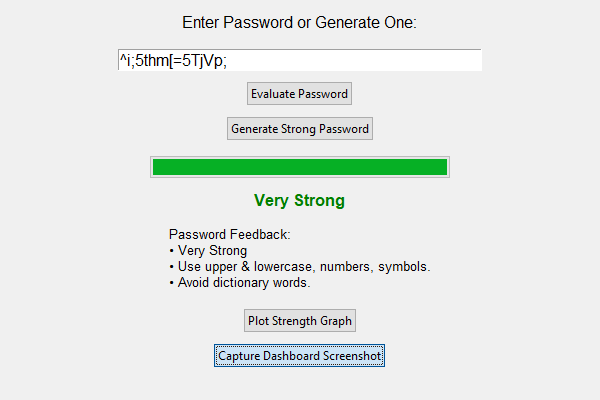
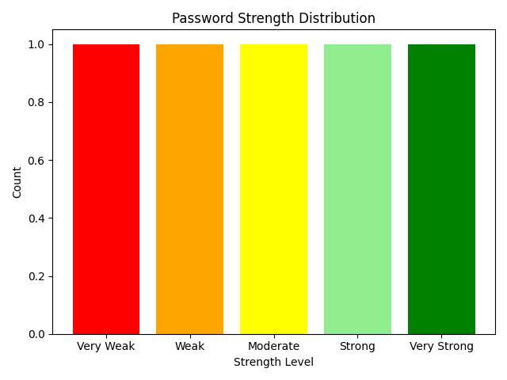

# Password-Strength-Evaluator

## 📸 GUI Screenshot

## 📈 Graph Output

## 🎯 Objective
To create a GUI-based Python application that uses machine learning to evaluate the strength of passwords and visualize results.

## ✅ Outcome
Classifies password strength using a trained RandomForestClassifier.
Generates strong passwords.
Displays strength via colored progress bars.
Visualizes password strength distribution using graphs.

## 🛠 Tools Used
Python 3.x
Tkinter (GUI)
Scikit-learn (ML)
Matplotlib (Graphs)
PIL (Screenshots)

## 🚀 Features
Real-time password strength evaluation.
Machine learning-based classification.
Strong password generator.
GUI dashboard with feedback.
Strength visualization using matplotlib.

## 🧠 Key Concepts
Password entropy
Brute-force & dictionary attacks
Authentication practices
ML model training

## Tips Learned
Small changes like adding symbols significantly improve strength. Use online tools to validate strength before use.

## 💬 Interview Questions 
1. What makes a password strong? 
2. What is a brute-force attack? 
3. What is a dictionary attack? 
4. How does complexity affect password strength?
5. Why should we avoid using dictionary words in passwords? 

## 📌 Future Considerations
Train with large, real-world datasets.
Add password leak checking via APIs.
Use deep learning for entropy estimation.

## 📄 Summary
This project demonstrates how password strength can be evaluated using a machine learning model and visualized via a user-friendly GUI with real-time feedback and graphical insights.
